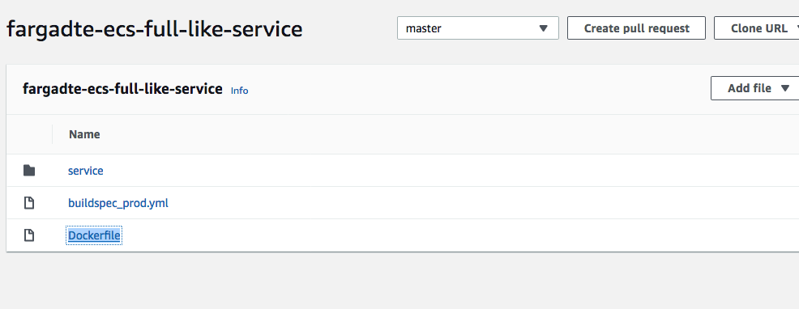

# Mythical Mysfits: DevOps with Docker and AWS Fargate

## Lab - Automating End to End Deployments for AWS Fargate for production environments

In this lab, you will implement the end to end deployment and testing process for your like service. This lab is where it all comes together. By the end, you will be able to check in new code and have your application automatically updated.

Here's what you'll be doing:

* Move the Source code to AWS CodeCommit. 

AWS CodeCommit is a fully-managed source control service that hosts secure Git-based repositories. It makes it easy for teams to collaborate on code in a secure and highly scalable ecosystem. CodeCommit eliminates the need to operate your own source control system or worry about scaling its infrastructure. You can use CodeCommit to securely store anything from source code to binaries, and it works seamlessly with your existing Git tools.

* Review the buildspec for production environments
The code pipeline and the buildspec has already been deployed through the initial CloudFormation template that was launched.

* Review the Code Pipeline for deployments
The code pipeline and the buildspec has already been deployed through the initial CloudFormation template that was launched.

* Deploy new version of Project Cuddle and test the End to End deployments.

### Configure Git credentials

Since most of the labs are going to be using git, let's set up our permissions now. There are a number of ways to authenticate with git repositories, and specifically CodeCommit in this case, but for the sake of simplicity, we'll use the CodeCommit credential helper here. Enter the following commands to configure git to access CodeCommit.

<pre>
$ git config --global credential.helper "cache --timeout=7200"
$ git config --global user.email "<b><i>REPLACEWITHYOUREMAIL</i></b>"
$ git config --global user.name "<b><i>REPLACEWITHYOURNAME</i></b>"
$ git config --global credential.helper '!aws codecommit credential-helper $@'
$ git config --global credential.UseHttpPath true
</pre>

### Clone the pre-created CodeCommit repos

1\. Review repos

Up until now, Mythical Mysfits hasn't really been doing anything with source repos, so let's start checking things into repos like we're supposed to.

Browse to AWS Code Commit in AWS console and review the repositories, you should see 2 repos created by our initial CFN template.
### StackName-like-service and
### Stackname-monolith-service.

2\. Clone the repos and copy in app code

Earlier in the workshop, we set up the CodeCommit credential helper, so we'll use the HTTPS clone URLs instead of SSH.

<pre>
$ cd ~/environment/
$ git clone <b><i>REPLACEME_LIKE_REPOSITORY_CLONEURL</b></i>
$ git clone <b><i>REPLACEME_MONOLITH_REPOSITORY_CLONEURL</b></i>
$ cp -R ~/environment/containers-sydsummit-workshop-2019/workshop-1/app/like-service/* <b><i>REPLACEME_LIKE_REPOSITORY_NAME</b></i>
$ cp -R ~/environment/containers-sydsummit-workshop-2019/workshop-1/app/monolith-service/* <b><i>REPLACEME_MONOLITH_REPOSITORY_NAME</b></i>
</pre>

## Lab Offloading Builds to AWS CodeBuild

In this lab, you will start the process of automating the entire software delivery process. The first step we're going to take is to automate the Docker container builds and push the container image into the Elastic Container Registry. This will allow you to develop and not have to worry too much about build resources. We will use AWS CodeCommit and AWS CodeBuild to automate this process. Then, we'll create a continuous delivery pipeline for our Like service in AWS Fargate.

You may be thinking, why would I want to offload my builds when I could just do it on my local machine. Well, this is going to be part of your full production pipeline. We'll use the same build system process as you will for production deployments. In the event that something is different on your local machine as it is within the full dev/prod pipeline, this will catch the issue earlier. You can read more about this by looking into **[Shift Left](https://en.wikipedia.org/wiki/Shift_left_testing)**.

Here's a reference architecture for what you'll be building:

Here's what you'll be doing:

* [Review AWS CodeBuild Project](#create-aws-codebuild-project)
* [Create BuildSpec File](#create-buildspec-file)

### Review AWS CodeBuild Project

1\. Review the configuration of AWS CodeBuild project.

We will be using AWS CodeBuild to offload the builds from the local Cloud9 instance. This was pre-created by the initial CFN template we ran.  In the AWS Management Console, navigate to the [AWS CodeBuild dashboard](https://console.aws.amazon.com/codebuild/home). Click on **Build projects**.

On the **Build projects** page, you will find a Project Named `Stackname-like-service-build`

**Review CodeBuild Environment:**

- Environment Image: **Managed Image** - *There are two options. You can either use a predefined Docker container that is curated by CodeBuild, or you can upload your own if you want to customize dependencies etc. to speed up build time*
- Operating System: **Ubuntu** - *This is the OS that will run your build*
- Runtime: Select **Docker** - *Each image has specific versions of software installed. See [Docker Images Provided by AWS CodeBuild](http://docs.aws.amazon.com/codebuild/latest/userguide/build-env-ref-available.html)*
- Runtime version: **aws/codebuild/docker:17.09.0** - *This will default to the latest*
- Privileged: **Leave as is** -  *In order for to run Docker inside a Docker container, you need to have elevated privileges*
- Service role: **New service role** - *A service role was automatically created for you via CFN*

Expand the **Environment Variables** and you will see the following :

- Name: `AWS_ACCOUNT_ID` - *Enter this string*
- Value: ***`REPLACEME_YOUR_ACCOUNT_ID`*** - *This is YOUR account ID*

**Buildspec:**

- Build Specification: *We will be providing CodeBuild with a buildspec file `buildspec_prod.yml` 

**Artifacts:**

- Type: Select **No artifacts** *If there are any build outputs that need to be stored, you can choose to put them in S3.*

Once you have reviewed the CodeBuild project move on to next step.

### Create BuildSpec File

1\. Create BuildSpec file

AWS CodeBuild uses a definition file called a buildspec Yaml file. The contents of the buildspec will determine what AWS actions CodeBuild should perform. The key parts of the buildspec are Environment Variables, Phases, and Artifacts. See [Build Specification Reference for AWS CodeBuild](http://docs.aws.amazon.com/codebuild/latest/userguide/build-spec-ref.html) for more details.

Another developer from the Mythical Mysfits team has started a buildspec_dev file for you, but never got to finishing it. Add the remaining instructions to the buildspec_dev.yml.draft file. The file should be in your like-service folder and already checked in. Let's create a dev branch and copy the draft to a buildspec_dev.yml file.

<pre>
$ cd ~/environment/<b><i>REPLACEME_LIKE_CODECOMMIT_REPO_NAME</b></i>
$ git checkout -b master
$ cp ~/environment/containers-sydsummit-workshop-2019/all-lab-modules/lab2a-option1-ecs-labs/03-automating-end-to-end-deployments-for-aws-fargate/hints/buildspec_dev.yml.draft buildspec_prod.yml
</pre>

Now that you have a copy of the draft as your buildspec, you can start editing it. The previous developer left comments indicating what commands you need to add (<b>These comments look like - #[TODO]:</b>). Add the remaining instructions to your buildspec_dev.yml.

Here are links to documentation and hints to help along the way. If you get stuck, look at the [hintspec_dev.yml](hints/hintspec_dev.yml) file in the hints folder:

<pre>
<b>#[TODO]: Command to log into ECR. Remember, it has to be executed $(maybe like this?)</b>

- http://docs.aws.amazon.com/AmazonECR/latest/userguide/Registries.html
- https://docs.aws.amazon.com/codebuild/latest/userguide/sample-docker.html#sample-docker-files

<b>#[TODO]: Build the actual image using the current commit ID as the tag...perhaps there's a CodeBuild environment variable we can use. Remember that we also added two custom environment variables into the CodeBuild project previously: AWS_ACCOUNT_ID. How can you use this?</b>

- https://docs.docker.com/get-started/part2/#build-the-app
- https://docs.aws.amazon.com/codebuild/latest/userguide/build-env-ref-env-vars.html

<b>#[TODO]: Tag the newly built Docker image so that we can push the image to ECR. See the instructions in your ECR console to find out how to do this. Make sure you use the current commit ID as the tag!</b>

<b>#[TODO]: Push the Docker image up to ECR</b>

- https://docs.aws.amazon.com/AmazonECR/latest/userguide/docker-push-ecr-image.html
- https://docs.docker.com/engine/reference/builder/#entrypoint
</pre>

When we create the buildspec_prod.yml file, we used CODEBUILD_RESOLVED_SOURCE_VERSION. What is CODEBUILD_RESOLVED_SOURCE_VERSION and why didn't we just use CODEBUILD_SOURCE_VERSION? You can find out in the [Environment Variables for Build Environments](http://docs.aws.amazon.com/codebuild/latest/userguide/build-env-ref-env-vars.html) documentation.

  

    HINT: Click here for a spoiler!
  

    For Amazon S3, the version ID associated with the input artifact. For AWS CodeCommit, the commit ID or branch name associated with the version of the source code to be built. For GitHub, the commit ID, branch name, or tag name associated with the version of the source code to be built. Since we will be triggering the build from CLI, the source version passed to CodeBuild will be 'dev', so that's what would show up if you use CODEBUILD_SOURCE_VERSION. Since we are using CODEBUILD_RESOLVED_SOURCE_VERSION, you will see the actual HEAD commit ID for our dev branch. 

Make sure you're in the like repository folder, which should be named something like **Stackname-like-service**.

<pre>
$ cd ~/environment/<b>REPLACE_ME_LIKE_REPOSITORY_NAME</b>

</pre>

Next, in order for CodePipeline to deploy to Fargate, we need to have an `imagedefinitions.json` file that includes the name of the container we want to replace as well as the imageUri. Then we have to surface the file to CodePipeline in an Artifacts section. The end of your buildspec_prod.yml file will look like this:

<pre>
...
    post_build:
      commands:
        - echo Build completed on `date`
        - echo Pushing the Docker image...
        - docker push $REPOSITORY_URI:$CODEBUILD_RESOLVED_SOURCE_VERSION
        - printf '[{"name":"REPLACEME_CONTAINERNAME","imageUri":"%s"}]' $REPOSITORY_URI:$CODEBUILD_RESOLVED_SOURCE_VERSION > imagedefinitions.json
artifacts:
  files: imagedefinitions.json
</pre>

Replace the container name with the name of your service, which should be `like-service`.

 HINT: There's also completed file in hints/hintspec_prod.yml. Click here to see how to copy it in.

  <pre>
  $ cp containers-sydsummit-workshop-2019/all-lab-modules/lab2a-option1-ecs-labs/03-automating-end-to-end-deployments-for-aws-fargate/hints/buildspec_prod.yml ~/environment/REPLACEME_REPO_NAME/buildspec_prod.yml
  </pre>

2\. cp containers-sydsummit-workshop-2019/all-lab-modules/lab2a-option1-ecs-labs/app/like-service ~/environment/REPLACEME_REPO_NAME/

Next we need to Add, commit, and push the new file to your repo. You can try to build the app again, but CodeBuild will just do the same thing because it's still looking at buildspec_prod.yml.

<pre>
  $ git add .
  $ git commit -m "Adding a buildspec for prod"
  $ git push origin master
</pre>

Once all files are committed you should see the following in the Code Commit Repo for like service.
1. Service Folder
2. buildspec_prod.yml
3. Dockerfile

### Review Pipeline for deployments

1\. Once you have committed the above files it would automatically trigger a deployment and you can review AWS CodePipeline.
Once the above pipeline runs successfully you are good to go ahead and deploy a new version opf the project for testing.

## Deploy new version of Project

Now that you have your application deploying automatically, let's deploy a new version!
We've upgraded the health check for our like service to make sure it can connect to the monolith service for the fulfillment method.

<pre>
$ cd ~/environment/REPLACEME_LIKE_REPO
$ cp ~/environment/containers-sydsummit-workshop-2019/all-lab-modules/lab2a-option1-ecs-labs/03-automating-end-to-end-deployments-for-aws-fargate/ mysfits_like_v2.py service/mysfits_like.py
$ git add service/mysfits_like.py
$ git commit -m "Cuddles v2"
$ git push origin master
</pre>

Now sit back, relax, and watch the deployment. When it's done, congratulations! You've unlocked the automated build and deploy achievement!

Once complete, please remember to follow the steps below in the **Workshop Cleanup** to make sure all assets created during the workshop are removed so you do not see unexpected charges after today.

## Workshop Cleanup

This is really important because if you leave stuff running in your account, it will continue to generate charges.  Certain things were created by CloudFormation and certain things were created manually throughout the workshop.  Follow the steps below to make sure you clean up properly.

Delete manually created resources throughout the labs:
* ECS service(s) - first update the desired task count to be 0.  Then delete the ECS service itself.
* ECR - delete any Docker images pushed to your ECR repository.
* CloudWatch logs groups
* ALBs and associated target groups

Finally, [delete the CloudFormation stack](http://docs.aws.amazon.com/AWSCloudFormation/latest/UserGuide/cfn-console-delete-stack.html) launched at the beginning of the workshop to clean up the rest.  If the stack deletion process encountered errors, look at the Events tab in the CloudFormation dashboard, and you'll see what steps failed.  It might just be a case where you need to clean up a manually created asset that is tied to a resource goverened by CloudFormation.

